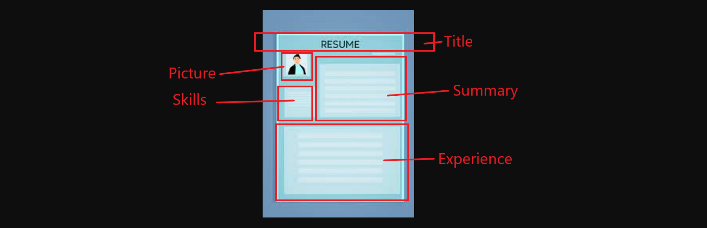

#  Project: React Resume

## Summary
Create a single page personal resume site using React. *(This may replace any previous resume site you have built).* 

## Estimated time
The estimated time is twelve hours.

## Additional Resources
- *React Documentation* - [React Tutorial](https://reactjs.org/tutorial/tutorial.html) 
- *LinkedIn Learning* - [React JS Essential Training](https://www.linkedin.com/learning/react-js-essential-training/building-modern-user-interfaces-with-react?)
- *LinkedIn Learning* - [React: Building Styles with CSS Modules](https://www.linkedin.com/learning/react-building-styles-with-css-modules-9222678/building-a-react-site-with-css-modules)
- *LinkedIn Learning* - [Introduction to CSS](https://www.linkedin.com/learning/introduction-to-css/welcome)
- *w3schools* - [W3 Schools CSS](https://www.w3schools.com/css/default.asp) 
- *w3schools* - [W3 Schools HTML](https://www.w3schools.com/html/default.asp)
- Animate.css - [Animate.css](https://animate.style/) 

## Project Objectives
You have freedom to drive the project and make it your own. You are not limited to the project objectives. Use information from your LinkedIn page and previous resume to build a resume site using React. The purpose of this project is to explore using CSS with React. Focus more on exploring React and CSS rather than perfecting a professional resume site.  *You may always return to this project later.*

| Project objectives |
| :-- |
| Demonstrate building a new React application  |
| Demonstrate incorporating CSS within React |
| Include at least one animation |
| Use the css :hover selector |

Your page does not need to be hosted on GitHub.

## Before you start

### Mock up your design
> *Weeks of coding saves hours of planning.*

Begin by creating a 'mock up' on scratch piece of paper.  Identify the 'high level' components you may want on your page.  Use information from your LinkedIn page and previous resume.  You should have an idea of  components you will need before you begin writing any code. 

Example of components
- Background component
- Layout Component
  - Title Component
  - Picture Component
  - Skills Component
  - Summary Component
  - Experience Component

### Review CSS
Review W3 Schools and other sites to remind yourself of many CSS properties.  Below are several important CSS concepts.

#### *Making a CSS Grid Layout*
- *W3 Schools* [CSS Grid](https://www.w3schools.com/css/css_grid.asp)
- *LinkedIn Learning* - [CSS Grid Layout Model](https://www.linkedin.com/learning/introduction-to-css/css-grid-layout-module)

#### *Horizontal & Vertical Aligning div elements*
- *W3 Schools* - [CSS Layout - Horizontal & Vertical Align](https://www.w3schools.com/css/css_align.asp)

#### *Reviewing the position property*
- *W3 Schools* - [CSS Layout - The position property](https://www.w3schools.com/Css/css_positioning.asp)

#### *Changing the cursors* **NEW**
- *W3 Schools* - [CSS cursor Property](https://www.w3schools.com/csSref/pr_class_cursor.asp)

#### *Hover and active selectors* **NEW**
- *W3 Schools* - [CSS :hover Selector](https://www.w3schools.com/cssref/sel_hover.asp)
- *W3 Schools* - [CSS :active Selector](https://www.w3schools.com/cssref/sel_active.asp)
